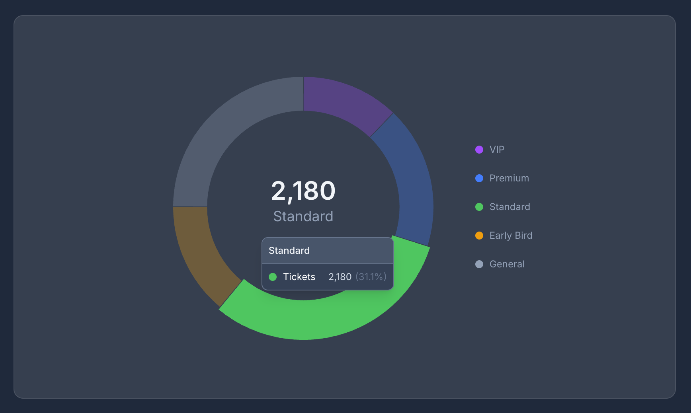

# Radial

Beautiful donut charts for [Flux UI](https://fluxui.dev). Drop-in components with hover effects, legends, and dark mode support.



## Requirements

- PHP 8.4+
- Laravel 11+
- Livewire Flux (^2.0)
- Tailwind CSS

## Installation

```bash
composer require jonpurvis/flux-radial
```

## Donut Component

A radial chart with a number in the center, perfect for SaaS dashboards. Segments highlight on hover, showing values in both a tooltip and the center.

### Data Structure

Each segment requires `label`, `value`, and `class`:

```php
$data = [
    ['label' => 'Critical', 'value' => 40, 'class' => 'text-red-500'],
    ['label' => 'Warning', 'value' => 25, 'class' => 'text-yellow-500'],
    ['label' => 'Healthy', 'value' => 35, 'class' => 'text-green-500'],
];
```

| Key | Type | Description |
|-----|------|-------------|
| `label` | `string` | Segment name (shown in tooltip and center on hover) |
| `value` | `int\|float` | Segment value (determines arc size) |
| `class` | `string` | Tailwind color class for the segment (e.g. `text-blue-500`) |

### Basic Usage

```blade
<flux:donut :data="$data" label="Total" />
```

### Props

| Prop | Type | Default | Description |
|------|------|---------|-------------|
| `data` | `array` | `[]` | Segments with `label`, `value`, and `class` (Tailwind color) |
| `label` | `string\|null` | `null` | Center label shown below the value |
| `value` | `int\|float\|null` | `null` | Override center value (defaults to sum of data) |
| `hover` | `string\|null` | `null` | Alternative label shown when hovering the center |
| `legend` | `false\|'top'\|'bottom'\|'left'\|'right'` | `false` | Show legend at specified position |
| `tooltip` | `bool` | `true` | Show tooltip on segment hover |
| `cutout` | `int` | `70` | Inner hole size (0 = solid, 70 = donut, 90 = thin ring) |
| `static` | `bool` | `false` | Disable hover/tap interactions |

### With Legend

Position the legend on any side:

```blade
<flux:donut :data="$data" legend="bottom" />
<flux:donut :data="$data" legend="top" />
<flux:donut :data="$data" legend="left" />
<flux:donut :data="$data" legend="right" />
```

### Center Hover Label

Show alternative text when hovering the center of the chart:

```blade
<flux:donut :data="$data" label="Total" hover="All Categories" />
```

### Sizing

Control size via the `class` attribute. The chart maintains a square aspect ratio:

```blade
<flux:donut :data="$data" class="size-64" />
<flux:donut :data="$data" class="max-w-xs mx-auto" />
```

### Thin Ring

Set `cutout` to `90` for a thin progress ring style:

```blade
<flux:donut :data="$data" :cutout="90" />
```

### Custom Center Value

Override the center value (defaults to the sum of all segments):

```blade
<flux:donut :data="$data" :value="85" label="Score" />
```

### Static Display

Disable hover interactions for a display-only chart:

```blade
<flux:donut :data="$data" :static="true" :tooltip="false" />
```

### Building Data from Eloquent

```php
$data = Order::query()
    ->selectRaw('status, count(*) as total')
    ->groupBy('status')
    ->get()
    ->map(fn ($row) => [
        'label' => $row->status,
        'value' => $row->total,
        'class' => match ($row->status) {
            'pending' => 'text-yellow-500',
            'completed' => 'text-green-500',
            'cancelled' => 'text-red-500',
            default => 'text-zinc-500',
        },
    ])
    ->toArray();
```